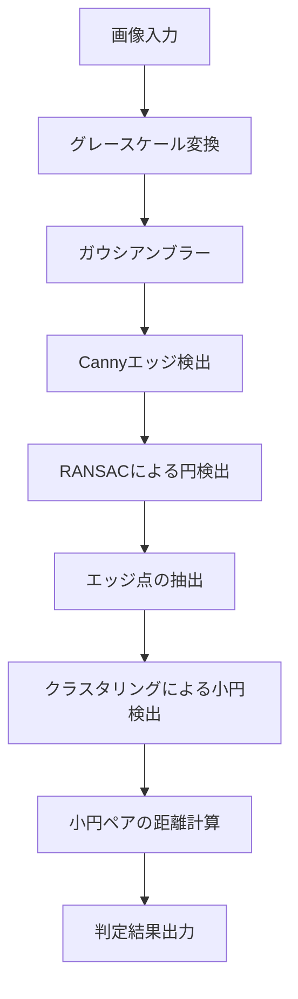

# 特発製作所 リング検出

リング内に穴が空いているかを判定する処理の開発を行う。

## フォルダ構成
本開発時のスコープのみ

```plaintext
├─doc                               ドキュメントフォルダ
├─img_detect                        検知した画像の格納フォルダ
│   ├─org_yyyyMMdd_hhmmss.jpg           穴検出時の読み込み画像
│   ├─edge_yyyyMMdd_hhmmss.jpg          穴検出時の二値化画像
│   └─hole_yyyyMMdd_hhmmss.jpg          穴検出時のリング描画画像
├─img_ng                            NG画像の格納フォルダ
│   └─yyyy-MM-dd                       日付ごとの格納
├─main.py                           カメラ設定などの全体コントロール処理
└─detect_holes.py                   穴検出処理
```

## インストール手順

1. 仮想環境の立ち上げ
    ```cmd
    python -m venv venv
    ```

2. pipモジュールのインストール
    ```cmd
    python -m pip install -r ./requirements.txt
    ```

3. [main.py](./main.py) の実行
    ```cmd
    python ./main.py
    ```

4. 【初回のみ】 PySimpleGUI のライセンスチェック とりあえず `Free Trial` をクリック
    * 参照：[PySimpleGUI 5を使うためにPySimpleGUI.comに登録する手順 #Python - Qiita](https://qiita.com/hideh_hash_845/items/af4fe7bfaaa099ac5dce)

## 仕様

### リング検出アルゴリズム

1. 画像をグレースケールに変換し、ガウシアンブラーを適用します。
2. Cannyエッジ検出を使用してエッジを抽出します。
3. RANSACアルゴリズムを使用してエッジ点から円を推定します。
    * 参照[detect_holes.py ransac_circle_detection()](./detect_holes.py#L59)

参照：[detect_holes.py circle_ransac()](./detect_holes.py#L114)

### リング判定アルゴリズム

1. 推定された円の内側と外側のエッジ点を抽出します。
2. クラスタリングを行い、小さな円を検出します。
3. 検出された小さな円のペアの距離を計算し、条件を満たすペアを判定します。

参照：[detect_holes.py detect_holes()](./detect_holes.py#L135)

### リング位置が中央あたりにある判定

* 参照：[main.py capture_from_cam()](./main.py#L330)

### 円の中心と半径の計算 (RANSACアルゴリズム内で使用する)

3点 \((x_1, y_1)\), \((x_2, y_2)\), \((x_3, y_3)\) から円の中心 \((cx, cy)\) と半径 \(r\) を求める。

中心 \((cx, cy)\) は以下の式で求められます：

$$
cx = \frac{(x_1^2 + y_1^2)(y_2 - y_3) + (x_2^2 + y_2^2)(y_3 - y_1) + (x_3^2 + y_3^2)(y_1 - y_2)}{2(x_1(y_2 - y_3) + x_2(y_3 - y_1) + x_3(y_1 - y_2))}
$$

$$
cy = \frac{(x_1^2 + y_1^2)(x_3 - x_2) + (x_2^2 + y_2^2)(x_1 - x_3) + (x_3^2 + y_3^2)(x_2 - x_1)}{2(x_1(y_2 - y_3) + x_2(y_3 - y_1) + x_3(y_1 - y_2))}
$$

半径 \(r\) は以下の式で求められます：

$$
r = \sqrt{(x_1 - cx)^2 + (y_1 - cy)^2}
$$

* 参照：[detect_holes.py fit_circle_3points()](./detect_holes.py#L21)

### 処理フロー



## 用語

### ガウシアンブラー

* ガウシアンブラーは、画像を平滑化するためのフィルタです。
* ガウス関数に基づいて画像の各ピクセルを周囲のピクセルと平均化し、ノイズを低減します。

### Cannyエッジ検出

* Cannyエッジ検出は、画像内のエッジを検出するためのアルゴリズムです。
* グレースケール画像に対して、**ガウシアンブラー、微分、非最大抑制、ヒステリシス閾値処理の順**に適用されます。

### ヒステリシス閾値処理

* ヒステリシス閾値処理は、エッジ検出の最後のステップです。
* 2つの閾値を使用し、高い閾値を超えるエッジを強いエッジとして保持し、低い閾値を超えるエッジを弱いエッジとして保持します。
* 弱いエッジは、強いエッジに接続されている場合にのみ保持されます。

### RANSACアルゴリズム

* RANSAC（Random Sample Consensus）は、データセット内の外れ値を排除しながらモデルを推定するためのアルゴリズムです。
* ランダムに選んだサンプルからモデルを推定し、インライア（モデルに適合するデータ点）の数を最大化することで最適なモデルを見つけます。

### Hough変換

* Hough変換は、画像内の形状を検出するための手法です。
* 特に直線や円の検出に使用されます。
* パラメータ空間における投票プロセスを通じて、エッジ点から形状を検出します。

## Tips

### `cv.HoughCircles`

* `cv.HoughCircles`は、画像内の円を検出するためのOpenCV関数です。
* Hough変換に基づいており、エッジ検出された画像から円を検出します。
* パラメータとして、累積分解能(dp)、最小距離(minDist)、エッジ検出の閾値(param1)、円検出の閾値(param2)、最小半径(minRadius)、最大半径(maxRadius)を指定します。

## References
1. [Canny法によるエッジ検出 — OpenCV-Python Tutorials 1 documentation](https://labs.eecs.tottori-u.ac.jp/sd/Member/oyamada/OpenCV/html/py_tutorials/py_imgproc/py_canny/py_canny.html)

